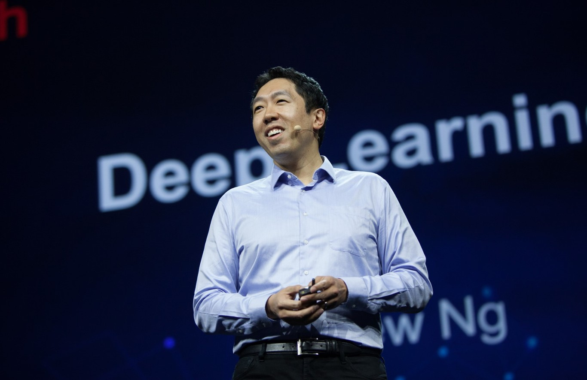

  
# Análisis de Hábitos de Estudio y Rendimiento Académico en Estudiantes Universitarios
Emilia Penagos Gallo, Maria Juliana Perdomo,Sebastían Romero Sierra, Juan Sebastián Chacón Ochoa

 

## Descripción del proyecto

Este proyecto busca desarrollar un modelo de Ciencia de Datos capaz de predecir el rendimiento académico de los estudiantes mediante el análisis de variables como asistencia a clases, horas de estudio, participación en actividades académicas y calificaciones anteriores.

La finalidad es identificar de manera temprana a los estudiantes que podrían presentar dificultades académicas y generar recomendaciones que contribuyan a mejorar su desempeño.

**Propósito**

El propósito de este proyecto es recopilar, organizar y analizar datos sobre los hábitos de
estudio de estudiantes universitarios para obtener información que permita comprender mejor
su comportamiento académico y apoyar la toma de decisiones basadas en datos.

***Problema a resolver***

las instituciones educativas no identifican a tiempo a aquellas personas que necesitan un 
mayor acompañamiento en su proceso de aprendizaje. En este sentido, el analizar los hábitos
de estudio del estudiante junto a su desempeño previo permite identificar con mayor velocidad
y eficiencia a los estudiantes que requieren ya sea tutorías o cualquier tipo de recurso 
institucional que pueda apoyarlo para mejorar su desempeño académico.

***Objetivos***

  

 Objetivo general 

Analizar los hábitos de estudio de estudiantes universitarios mediante la recopilación,
organización y visualización de datos para identificar patrones y tendencias relacionadas con
el rendimiento académico.

  

 Objetivos específicos 

- Identificar los hábitos de estudio con mayor impacto en el desempeño académico de los estudiantes
- Identificar los estudiantes que necesitan herramientas para reforzar sus habilidades y mejorar su desempeño académico 
- Agilizar los procesos de apoyo a estudiantes con malos hábitos de estudio
  

***Metodología***

| Paso | Descripción|
|---------------|-----------------------------|
| Paso 1 | Recolección de datos: encuesta a estudiantes universitarios para obtener información sobre hábitos de estudio, asistencia, horas de sueño, tiempo en redes sociales y rendimiento académico |
| Paso 2 | Creación de la base de datos: Los datos recopilados se organizarán en tablas |
| Paso 3 | Construcción del modelo relacional: Se establecerán relaciones entre las diferentes tablas mediante las keys vistas en clase para garantizar una correcta organización de la información |
| Paso 4 | Uso de Power Pivot: Se implementará Power Pivot para administrar el modelo de datos y obtener indicadores relevantes para el análisis |
| Paso 5 | Transformación y análisis de datos: Se procesará la información para identificar tendencias, frecuencias, porcentajes y otras métricas de interés |
| Paso 6 | Tablero de Visualización: Construir un dashboard con gráficos, tablas dinámicas e indicadores que permitan visualizar los resultados de forma clara e interactiva y su relación entre sí |
| Paso 7 | Interpretación de resultados: conclusiones a partir de evidencia |

***Rol del científico de datos***

En este proyecto, el científico de datos específicamente es encargado de recopilar, organizar, transformar y analizar la
información obtenida. Además, diseñará la base de datos, construirá el modelo relacional,
definirá las claves necesarias para garantizar la calidad de los datos, utilizará herramientas
como Power Pivot para realizar análisis y desarrollará un tablero de visualización que facilite
la interpretación de los resultados. Su función principal será convertir los datos en
información útil que permita comprender mejor los hábitos de estudio de los estudiantes y
apoyar la toma de decisiones.

Andrew Ng fue nuestro científico de datos escogido cuyos proyectos explicados a continuación en su profesión de científico de datos tienen una propuesta similar a la de nuestro proyecto.

  
 Haz click para ver toda la información de Andrew Ng 

  

# Andrew Ng
## Sus proyectos liderados y ejecutados como Científico de Datos
Emilia Penagos Gallo, Maria Juliana Perdomo,Sebastían Romero Sierra, Juan Sebastián Chacón Ochoa

 

#### **Datos importantes**
| Información | Datos|
|---------------|-----------------------------|
| Nombre completo | Andrew Yan-Tak Ng |
| Fecha de Nacimiento | 18 de abril de 1976 |
| Lugar de nacimiento | Londres, Reino Unido|
|  Nacionalidad | Británica y estadounidense|
| Estudios | Graduado en Ciencias de la computación, estadística y economía y también en Ingeniería Eléctrica. Además tiene un doctorado en Ciencias de la computación en las universidades de Mellon, MIT y Berkely respectivamente|

## Proyectos liderados y ejecutados por Andrew Ng 
  

  

 Google Brain 

  
  Proyecto de investigación en inteligencia artificial dentro de Google
  
  *Propósito*
  
   Inició en el 2011 con el propósito de crear sistemas capaces de aprender a partir de grandes cantidades de datos (inteligencia artificial)
   
  *Actualidad*
  
  El proyecto impulsó tecnologías de:
  
  1.1 reconocimiento de voz
  
  1.2 traducción automática
  
  1.3 Visión por computador...
  
  Actualmente se integró con otros equipos para formar ***Google DeepMind*** por lo que continúa en desarrollo
  

  

 Coursera 

  
  Plataforma de educación en línea cofundada por Andrew Ng en 2012
  
  *Propósito*
  
  Facilitar el acceso a la educación de alta calidad permitiendo que estudiantes de cualquier parte del mundo puedan acceder a cursos de los temas de interés.
   
  *Actualidad*
  
  La plataforma existe, incluso siendo utilizada por la misma Universidad de los Andes y ofrece programas de :
  
  1.1 tecnología
  
  1.2 negocios
  
  1.3 Ciencia de datos e inteligencia artificial
  
  La plataforma tiene alrededor de 200 millones de usuarios en todo el mundo
  

  

 DeepLearning.AI 

  
  Fundada en 2017 por él mismo para formar profesionales en inteligencia artificial y aprendizaje profundo.
  
  *Propósito*
  
  Desarrollar cursos, certificaciones, material educativo y programas de capacitación para estudiantes, investigadores y profesionales.
   
  *Actualidad*
  
  Colabora con empresas tecnológicas líderes para ofrecer formación práctica en herramientas modernas de inteligencia artificial generativa y aprendizaje automático
  

  

 Landing.AI 

  
  Fundada en 2017 por él mismo para facilitar la adopción de la inteligencia artificial en organizaciones e industrias.
  
  *Propósito*
  
  Transformar datos e información no estructurada en información útil mediante herramientas de IA.
   
  *Actualidad*
  
  La empresa desarrolla tecnologías capaces de extraer información de documentos empresariales y automatizar procesos de análisis de datos que anteriormente requerían trabajo manual de las personas.
  

  

 AI Fund 

  
  Estudio de emprendimiento fundado en 2018 por él mismo para crear y apoyar nuevas empresas que están surgiendo basadas en inteligencia artificial
  
  *Propósito*
  
  Identificar oportunidades donde la IA pueda resolver problemas reales y acompañar a emprendedores en la construcción de productos innovadores
   
  *Actualidad*
  
  Ha participado en la creación y desarrollo de más de 40 empresas basadas en inteligencia artificial, entre ellas LandingAI, Affineon Health... aplicando la IA en sectores como salud, educación, finanzas, entre otros.
  

Este proyecto comparte el mismo enfoque de varios proyectos liderados por Andrew Ng, como Google Brain, donde se utilizaban grandes volúmenes de datos para identificar patrones y generar conocimiento útil, y DeepLearning.AI, iniciativa en la que promueve el uso de datos para resolver problemas reales. Con base en lo anterior, este proyecto planteado recopila, organiza y analiza datos sobre hábitos de estudio para identificar tendencias y apoyar la toma de decisiones en el ámbito educativo. Aunque su alcance es más pequeño y no utiliza inteligencia artificial, sigue el mismo principio fundamental aplicado por Andrew Ng en muchos de sus proyectos: transformar datos en información valiosa

